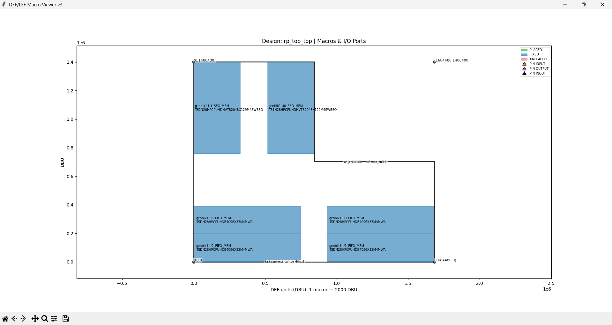
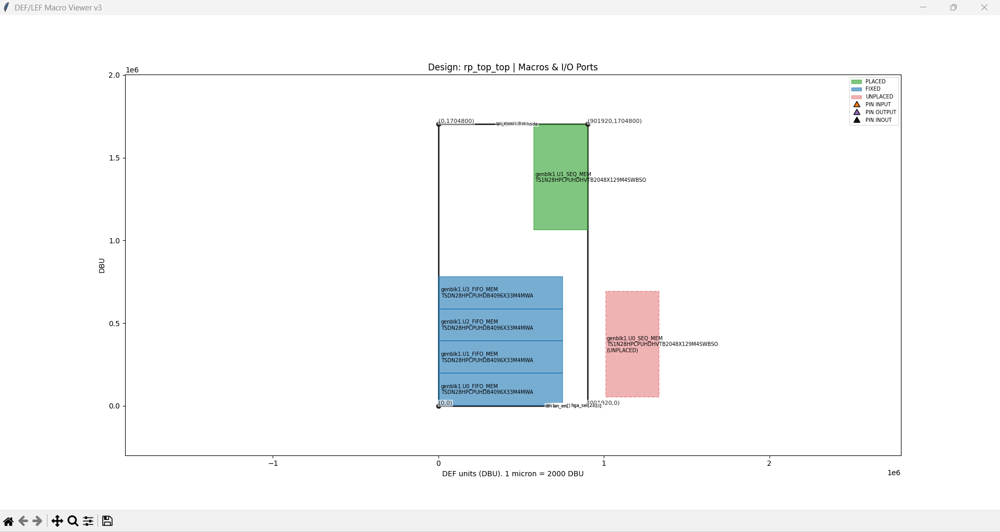

# DEF/LEF Macro Viewer

A Python application to **visualize DEF and LEF macro placements and I/O pins** for ASIC/SoC designs. The tool uses **Tkinter** for GUI and **Matplotlib** for plotting, providing an interactive way to inspect the chip layout during backend design stages.

---

## Overview

During **VLSI backend design**, understanding the placement of macros and I/O pins is critical for timing closure, routing, and physical verification. This tool allows engineers to:

- Load DEF (Design Exchange Format) and LEF (Library Exchange Format) files.  
- Visualize **placed, fixed, and unplaced macros**.  
- Inspect **I/O pin locations and directions**.  
- Export the visual layout as a PNG image for documentation or analysis.  

It is lightweight, cross-platform (Windows/Linux), and ideal for **quick physical layout checks**.

---

## Features

- Parse DEF and LEF files to extract component placements and macro sizes.  
- Visualize die area, macros, and pins interactively.  
- Distinguish between **PLACED**, **FIXED**, and **UNPLACED** macros with color coding.  
- Identify pin types: **INPUT**, **OUTPUT**, and **INOUT**.  
- Scroll to zoom, right/middle mouse drag to pan the layout.  
- Export the visualization as high-resolution PNG.  

---

## Requirements

- Python 3.x  
- Tkinter (usually included with Python)  
- Matplotlib  

Install Matplotlib if needed:

```

pip install matplotlib

```

---

## Installation

1. Clone this repository:

```

git clone [https://github.com/yourusername/DEF_LEF_Viewer.git](https://github.com/yourusername/DEF_LEF_Viewer.git)
cd DEF_LEF_Viewer

```

2. (Optional) Create a virtual environment:

```

python -m venv venv

# Linux/Mac

source venv/bin/activate

# Windows

venv\Scripts\activate

```

3. Install dependencies:

```

pip install -r requirements.txt

```

---

## Usage

Run the application:

```

python viewer.py

```

You can also specify DEF and LEF files via command-line:

```

python viewer.py --def path/to/design.def --lef path/to/library.lef

```

- Use the GUI entries to load different DEF/LEF files dynamically.  
- Click **Save PNG** to export the current view.

---

## File Format Support

- **DEF (Design Exchange Format)**:  
  - Extracts the **die area**, **macro instances**, and **pins**.  
  - Supports `UNPLACED`, `PLACED`, and `FIXED` macros.  

- **LEF (Library Exchange Format)**:  
  - Extracts **macro sizes** for correct scaling in the layout view.

---

## Controls & Interaction

| Action | Control |
|--------|---------|
| Zoom | Scroll wheel |
| Pan | Right or middle mouse drag |
| Reset View | Press `r` key |
| Save as PNG | Click "Save PNG" button |
| Load new DEF/LEF | Enter paths in text boxes and click "Load" |

---

## Example

- Load your DEF/LEF files in the GUI.  
- Placed macros appear in **green**, fixed macros in **blue**, and unplaced macros in **red**.  
- Pins are visualized as triangles with different colors: **orange = INPUT**, **purple = OUTPUT**, **black = INOUT**.  
- Labels show instance and cell names for each macro and pin.  

Sample screenshot :




---

## Contributing

Contributions are welcome! You can:

- Add new visualization features.  
- Support additional DEF/LEF variations.  
- Improve GUI interactivity.  

Please fork the repository, create a feature branch, and submit a pull request.

---

## License

This project is released under the **MIT License**.

## Contact

For questions or suggestions, open an issue in this repository or contact the maintainer.


